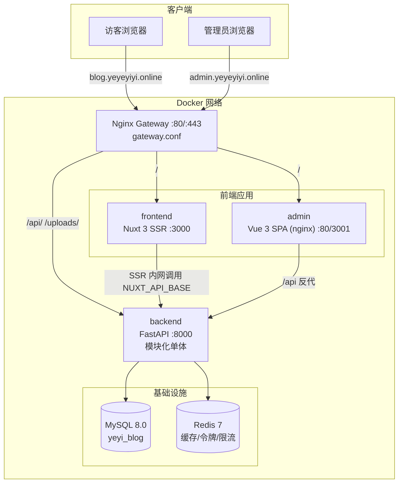
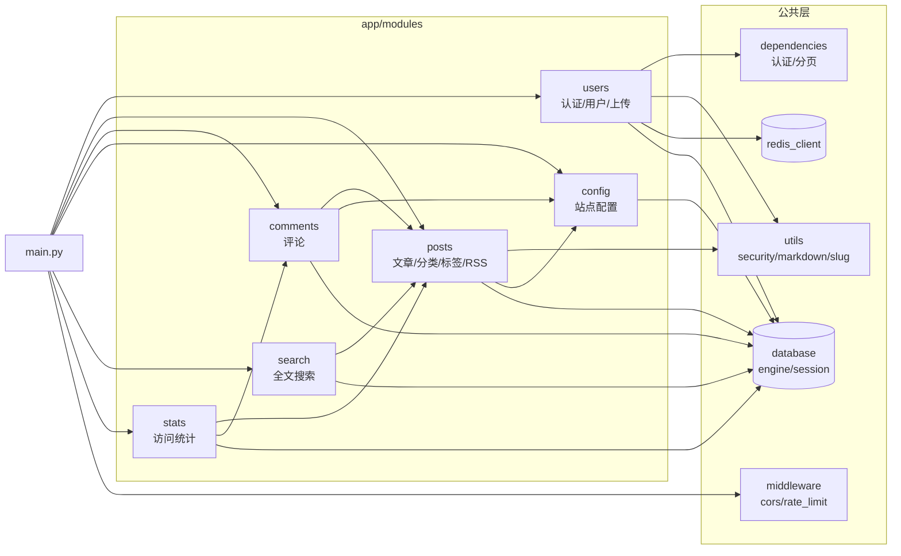
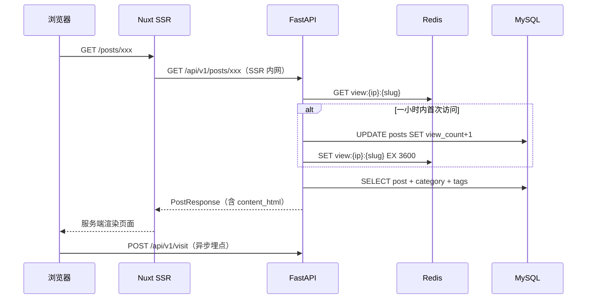

# 01 架构总览

## 1. 系统架构

项目采用**前后端分离 + 模块化单体后端**架构。后端按业务域组织为 6 个模块（每个模块拥有独立的 router / service / model / schema），为将来拆分微服务预留了边界。

**流量路径说明：**

- 生产/开发网关按域名分流：`blog.yeyeyiyi.online` → frontend；`admin.yeyeyiyi.online` → admin；两个域名的 `/api/`、`/uploads/` 均反代到 backend；另有 `api.yeyeyiyi.online` 直达 backend。
- 博客前台在 SSR 阶段通过内网地址 `http://backend:8000/api/v1`（环境变量 `NUXT_API_BASE`）调用 API；浏览器端则走同域 `/api/v1`（相对路径），由网关转发，避免跨域。
- 管理后台是纯 SPA，浏览器请求同域 `/api/v1`，由所在 nginx 容器反代到 backend。

## 2. 技术栈

| 层 | 技术 | 版本要点 | 说明 |
|----|------|----------|------|
| 博客前台 | Nuxt 3 (Vue 3) | nuxt ^3.17 | SSR 渲染，`@nuxtjs/tailwindcss` + `@nuxtjs/color-mode` |
| 管理后台 | Vue 3 + Vite + TypeScript | vite ^8 | UI 库 Element Plus，状态 Pinia，HTTP axios，图标 lucide |
| 后端 API | FastAPI (Python 3.11) | fastapi 0.115 | 全异步，SQLAlchemy 2.0 async + asyncmy 驱动 |
| ORM/迁移 | SQLAlchemy 2.0 / Alembic | 2.0.35 / 1.13 | 异步引擎，声明式模型 |
| 数据库 | MySQL 8.0 | — | 主存储，7 张表 |
| 缓存 | Redis 7 | redis-py 5.1 asyncio | refresh token、浏览量防刷、限流计数 |
| 认证 | JWT (python-jose) + bcrypt | — | access 2h / refresh 7d |
| Markdown | markdown-it-py + mdit-py-plugins | — | 后端渲染文章；前台 about 页前端渲染 |
| RSS | feedgen 1.0 | — | `/api/v1/rss.xml` 最近 20 篇 |
| 部署 | Docker Compose + Nginx + GitHub Actions | — | 镜像推送阿里云 ACR，SSH 拉起 |

## 3. 三大子项目职责

### 3.1 backend —— 后端 API（模块化单体）

- 唯一的可执行服务：`uvicorn app.main:app`（入口 `app/main.py`）
- 所有路由统一挂载在 `/api/v1` 前缀下
- 公开接口（前台用）与管理接口（`/admin/*`，需 JWT + admin 角色）共存于同一服务
- 承担：认证、文章/分类/标签 CRUD、评论、搜索、访问统计、站点配置、图片上传、RSS

### 3.2 frontend —— 博客前台（Nuxt 3 SSR）

- 面向访客的只读界面：首页列表、文章详情（TOC + 评论区）、分类/标签/归档/搜索/关于
- `layouts/default.vue` 全局拉取站点配置并在路由切换时上报访问日志（`POST /api/v1/visit`）
- 通过 `useApi()` composable 封装 `$fetch`，SSR 走内网 API 地址

### 3.3 admin —— 管理后台（Vue 3 SPA）

- 面向管理员的控制台：仪表盘、文章编辑（Markdown + 图片上传）、评论审核、分类/标签管理、站点配置、访问统计、修改密码
- axios 拦截器自动附带 `Bearer token`，401 时自动登出跳转登录页
- 开发模式由 Vite 将 `/api`、`/uploads` 代理到 `localhost:8000`

## 4. 后端模块划分与依赖关系

**关键依赖事实（跨模块调用均通过 service 层，不直接访问他模块 model/repository）：**

| 调用方 → 被调方 | 用途 | 位置示例 |
|----------------|------|----------|
| posts → config | RSS 生成时读取站点标题/副标题 | `posts/rss.py` 调 `config.service.get_all_config` |
| comments → posts | 通过 `post_slug` 解析 `post_id` | `comments/service.py` |
| comments → config | 提交评论前检查 `comment_enabled` | `comments/router.py` |
| search → posts | 直接查询 `Post` 模型（只读复用） | `search/service.py` |
| stats → posts/comments | 统计已发布文章数/已批准评论数 | `stats/service.py` |
| dependencies → users | `get_current_user` 查 `User` 表 | `dependencies.py` |

**数据库层面外键依赖：** `comments.post_id → posts.id`（CASCADE）、`posts.category_id → categories.id`（SET NULL）、`post_tags` 多对多关联。详见 [03-数据模型](./03-数据模型.md)。

## 5. 运行时数据流（典型场景）

### 5.1 访客阅读文章

### 5.2 管理员发布文章

admin 登录获得 JWT → `POST /api/v1/admin/posts`（Bearer）→ `require_admin` 校验 → service 层：标题转拼音生成 slug、markdown-it 渲染 `content_html`、截取 200 字摘要 → 事务由 `get_db` 统一 commit → `POST /admin/posts/{id}/publish` 置为 published 并写 `published_at`。

## 6. 架构决策与现状说明

| 主题 | 决策/现状 |
|------|-----------|
| 单体 vs 微服务 | 当前为模块化单体；模块目录即未来微服务边界（设计文档规划 6 服务、端口 8001-8006） |
| 事务管理 | service 层只 `flush` 不 `commit`；`get_db` 依赖在请求结束时统一 `commit/rollback` |
| 建表方式 | 应用启动时 `Base.metadata.create_all` 兜底 + Alembic 迁移（entrypoint 先执行 `alembic upgrade head`） |
| 限流 | `middleware/rate_limit.py` 已挂载 Redis 固定窗口限流：登录 10 次/分、评论 5 次/分、搜索 30 次/分、管理员上传 50 次/时，按真实客户端 IP 计数 |
| token 刷新 | 后端提供 `/auth/refresh`；admin axios 对 401 使用共享队列静默刷新并重放原请求，refresh 失败才清理登录态 |
| 搜索 | MySQL `LIKE %q%`（非 FULLTEXT/ngram），匹配 title/content_md/excerpt |
| 统计聚合 | `visit_stats` 表与模型已存在，但**无定时聚合任务**；趋势接口直接对 `visit_logs` 按日 GROUP BY 实时计算 |

## 7. MCP 管理服务

`mcp` 是与 backend 分开运行的 MCP Streamable HTTP 服务，监听容器内 `8100` 端口，共享 MySQL、Redis 和 `uploads_data` 卷。公网入口为 `https://blogmcp.yeyeyiyi.online/mcp`，通过 `?tavilyApiKey=<key>` 或 `X-MCP-API-Key` 独立鉴权，不复用后台 JWT。

MCP 工具层复用 posts/comments/config/stats/users 的 service，提供文章、分类、标签、评论、站点配置、统计和图片上传管理；删除操作要求 `confirm=true`。网关对 `/mcp` 关闭缓冲并保留长连接。

MCP 管理状态由 `mcp_service_settings` 单例配置和 `mcp_api_keys` 多 Key 表保存，Key 使用 Fernet 加密；`mcp_request_logs` 保存调用与 Key 归属元数据。admin 通过 `/api/v1/admin/mcp/*` 管理设置、Key 和日志，MCP 进程通过 Redis 缓存并在 Key 变更后立即失效。
