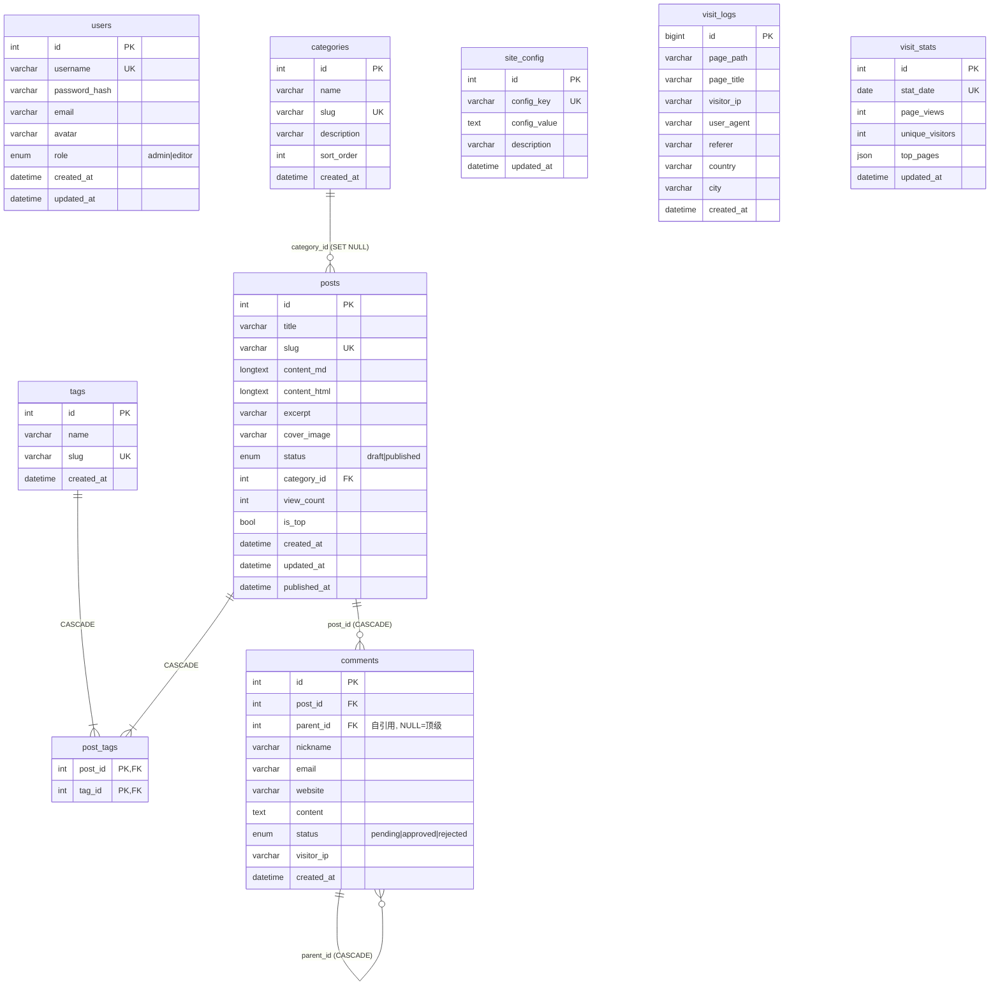

# 03 数据模型

数据库：MySQL 8.0，库名 `yeyi_blog`（开发 root/root）。模型定义全部使用 SQLAlchemy 2.0 声明式（`Mapped[]` + `mapped_column`），统一继承 `app/database.py` 的 `Base`。

## 1. ER 关系图

## 2. 表清单与职责

| 表 | 所属模块 | 模型类 | 职责 |
|----|----------|--------|------|
| users | users | `User` | 管理员账号，仅用于后台登录 |
| posts | posts | `Post` | 文章主体，Markdown 原文与渲染 HTML 双存储 |
| categories | posts | `Category` | 分类，`sort_order` 控制前台顺序 |
| tags | posts | `Tag` | 标签 |
| post_tags | posts | `Table("post_tags")` | 文章-标签多对多关联（复合主键） |
| comments | comments | `Comment` | 访客评论，自引用嵌套 |
| site_config | config | `SiteConfig` | 站点 KV 配置 |
| visit_logs | stats | `VisitLog` | 访问明细流水 |
| visit_stats | stats | `VisitStats` | 按日聚合统计（暂无写入方，预留） |

## 3. 关键字段说明

### posts

| 字段 | 类型/约束 | 说明 |
|------|-----------|------|
| `slug` | varchar(200), unique | URL 标识；创建时缺省由标题拼音生成（`utils/slug.py`）；冲突返回 409 |
| `content_md` / `content_html` | Text | 写作时只提交 `content_md`，服务端用 markdown-it 渲染出 `content_html` 一并存库，前台直接 v-html 输出 |
| `excerpt` | varchar(500) | 摘要；未提供时截取正文前 200 字 |
| `status` | enum(draft/published) | 默认 draft；发布时写 `published_at=now()` |
| `is_top` | bool | 列表排序权重最高（`is_top DESC, published_at DESC`） |
| `category_id` | FK → categories.id, **SET NULL** | 删除分类后文章保留、分类置空 |

### comments

| 字段 | 说明 |
|------|------|
| `parent_id` | NULL 为顶级评论；非空表示回复某条评论，形成两级嵌套；级联删除 |
| `status` | pending（默认，需后台审核）→ approved（前台可见）/ rejected |
| `visitor_ip` | 服务端从 `request.client.host` 记录，最大 45 字符（兼容 IPv6） |

### site_config

纯 KV 表。读取时以代码中的 `DEFAULT_CONFIG`（10 个键）为底，数据库行覆盖；`comment_enabled` / `comment_need_review` 以 `"true"/"false"` 字符串存储、出口转 bool；`social_links` 以 JSON 字符串存储、出口反序列化为对象。详见 [02-后端详解 §8.4](./02-后端详解.md)。

### visit_logs / visit_stats

- 明细表由前台每次路由切换 `POST /api/v1/visit` 写入；`country/city` 字段预留（当前不写入）。
- 聚合表与模型就绪，但**没有定时任务**；趋势查询直接对 `visit_logs` 按日 `GROUP BY` 实时计算（`func.count` = PV，`count(distinct visitor_ip)` = UV）。

## 4. 关系加载策略

文章相关查询统一使用 `selectinload(Post.category)` + `selectinload(Post.tags)`（一条 IN 预载查询），避免异步 ORM 的懒加载报错与 N+1。评论列表使用 `selectinload(Comment.replies)` 预载全部回复。

## 5. 建表与迁移

| 机制 | 时机 | 说明 |
|------|------|------|
| `Base.metadata.create_all` | 应用 lifespan 启动 | 幂等兜底，缺表才建；本地开发与测试均依赖此机制 |
| Alembic `upgrade head` | 容器 entrypoint 第一步 | 正式迁移链：初始迁移 `19c34fbeac15_initial_tables` |
| `seed.py` | 容器 entrypoint 第二步 | 写入 admin 用户与基础配置（存在即跳过） |

开发新字段流程：改 `model.py` → `alembic revision --autogenerate -m "..."` → `alembic upgrade head`（或依赖 create_all 在全新环境生效）。

## 6. MCP 管理表

`mcp_service_settings` 是单例配置表，保存服务启停、限流、Host/Origin、日志保留期和最后修改管理员；`mcp_api_keys` 保存多个加密 Key、名称、指纹、启停状态、使用次数和最后使用时间。`mcp_request_logs` 保存 MCP 请求审计元数据及 Key ID/名称快照，按请求时间、工具、IP、成功状态和 Key 建立索引；不保存请求正文或密钥。迁移版本为 `a4b6c8d0e2f1`。
