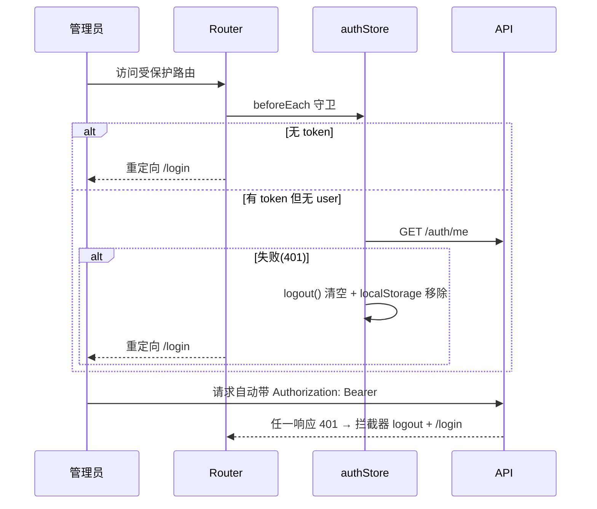

# 05 前端详解

前端包含两个独立子项目：**frontend**（Nuxt 3 博客前台，面向访客）与 **admin**（Vue 3 管理后台）。二者只通过 REST API 与后端通信，无共享代码。

---

## A. 博客前台 frontend（Nuxt 3）

### A1. 技术与配置

- Nuxt 3 SSR（`ssr: true`），模块：`@nuxtjs/tailwindcss`、`@nuxtjs/color-mode`（preference/fallback 均为 light，`classSuffix: ''`，即 `.dark` class 切换）
- `runtimeConfig`：私有 `apiBase`（服务端可用环境变量 `NUXT_API_BASE` 覆盖，容器内为 `http://backend:8000/api/v1`）与 `public.apiBase`（默认 `/api/v1`；本地 Compose 显式配置为 `http://localhost:8000/api/v1`）
- 全局 head：中文标题、viewport、OG 标签、theme-color `#F8F7F4`，预加载方圆体字体
- 运行时依赖：`markdown-it`、`katex`、`prismjs`（about 页前端渲染）、`lucide-vue-next` 图标
- 样式：Tailwind + `assets/css/main.css`（Rocom 设计 token：`rocom-bg`/`rocom-primary` 金色等）+ `typography.css`；暗色主题的正文、标题、列表、表格和引用统一使用 CSS token，避免硬编码浅色值导致正文不可见。

```
frontend/
├── app.vue                    # 根组件：NuxtLayout > NuxtPage
├── nuxt.config.ts
├── layouts/default.vue        # 全局布局：站点配置加载 + 访问埋点 + Header/Footer + 三栏侧栏
├── composables/
│   ├── useApi.ts              # $fetch 封装（SSR/CSR 自动切换 baseURL）
│   ├── useSiteConfig.ts       # 站点配置单例缓存
│   └── useVisit.ts            # 访问埋点
├── components/                # 14 个自动导入组件
├── pages/                     # 文件路由
│   ├── index.vue              # 首页
│   ├── posts/[slug].vue       # 文章详情
│   ├── categories.vue / tags.vue / archive.vue / search.vue / about.vue
└── assets/css/                # main.css / typography.css
```

### A2. 核心逻辑

#### `composables/useApi.ts` — API 客户端

```ts
const baseURL = import.meta.server
  ? (config.apiBase || config.public.apiBase)   // SSR：内网地址（容器间通信）
  : config.public.apiBase                        // 浏览器：同域 /api/v1

return { get, post, put, del }                   // 均为 $fetch 泛型包装
```

#### `composables/useSiteConfig.ts` — 站点配置

模块级 `ref` 单例缓存：首次 `fetchConfig()` 调 `GET /site/config` 后常驻内存，SSR 请求间复用，避免每个页面重复拉取。

#### `layouts/default.vue` — 全局布局

- 顶层 `await fetchConfig()`（阻塞渲染，保证 `useHead` 有站点标题/favicon）
- `useHead` 动态设置标题与 favicon（带 `?v=时间戳` 防缓存）
- `watch(route.fullPath, immediate)` + `nextTick` → `recordVisit()`：每次路由切换在客户端上报 `POST /visit`（失败静默）
- 结构：`AppHeader` + `<main id="main-content">` + `AppFooter`；宽桌面（`>=1280px`）为 `224px / minmax(0,1fr) / 224px` 三栏，中央内容保持独立阅读宽度。
- `SiteLeftSidebar` 提供头像、站点信息、社交链接、公告、分类和标签快速入口；`SiteRightSidebar` 提供最新文章、公开统计，文章详情页切换为 H2/H3 目录。两侧均为 sticky widget，`<1280px` 完全隐藏。
- 侧栏数据使用 `GET /categories`、`GET /tags`、`GET /site/announcement`、`GET /posts?page=1&page_size=5` 和公开 `GET /stats/summary`，通过 `useAsyncData` 缓存。
- 公告由 `AnnouncementBar` 与左栏摘要共用 `useAnnouncementModal`，全局 `AnnouncementModal` 负责完整版展示、遮罩/关闭按钮/ESC 关闭、滚动锁定和焦点返回；页面切换由 Nuxt `pageTransition` 统一使用 220ms 浮现动画。
- RSS 公开接口保留在 `GET /rss.xml`，但目前按产品决定不在桌面或移动导航显示入口；需要恢复时应使用 `public.apiBase` 拼接地址，避免本地 `3000` 将 `/api/*` 误判为前台路由。

### A3. 页面

| 路由 | 文件 | 数据来源 | 说明 |
|------|------|----------|------|
| `/` | `pages/index.vue` | `GET /posts`、`GET /site/announcement` | 公告条 AnnouncementBar + PostCard 网格 + Pagination；分页用 `?page=` query，分类/标签筛选用 `?category=` / `?tag=` 并随分页保留 |
| `/posts/:slug` | `pages/posts/[slug].vue` | `GET /posts/{slug}`、`GET /posts/{slug}/comments` | 标题/PostMeta（分类、标签、时间、浏览量）+ `v-html` 正文 + TableOfContents + CommentSection；无数据抛 404 错误页 |
| `/categories` | `pages/categories.vue` | `GET /categories` | 分类卡片（含文章数） |
| `/tags` | `pages/tags.vue` | `GET /tags` | 标签云 |
| `/archive` | `pages/archive.vue` | `GET /posts?page=&page_size=50` | 前端按发布年份分组的时间线列表，分页访问全部文章 |
| `/search` | `pages/search.vue` | `GET /search?q=` | `useAsyncData` watch query/page 联动；PostCard 结果网格 |
| `/about` | `pages/about.vue` | `GET /site/config` | 取 `about_content`（Markdown），**前端**用 markdown-it 渲染（含 katex/prism 支持） |

**文章详情 TOC 实现**：`[slug].vue` 先为正文中没有 id 的 H2/H3 生成稳定的 `section-*` 锚点，再从渲染后的 HTML 提取 H2/H3，生成 `{id, text, level}` 数组存入 `active-post-toc`，由全局右栏交给 `TableOfContents`。H2 为主层级，H3 缩进，H4 排除；无目录时右栏回退到最新文章和统计。

首页和搜索页使用 `post-grid` 自动填充网格：单篇结果占满中央阅读区，多篇结果按最小稳定列宽分栏，避免宽桌面出现无意义的大块空洞。

**公开统计与头像配置**：`GET /api/v1/stats/summary` 不需要登录，仅返回 `today_pv`、`published_posts`、`categories`、`tags`、`approved_comments`。`GET /site/config` 增加 `avatar_url`；admin 的站点配置页复用 `/api/v1/admin/upload` 支持头像上传或 URL 输入，空值由前台显示站点首字符。

### A4. 组件清单（components/，Nuxt 自动导入）

| 组件 | 职责 |
|------|------|
| `AppHeader` / `AppFooter` | 页头导航（含 SearchBox、DarkToggle）/ 页脚（footer_text + social_links） |
| `AnnouncementBar` | 首页公告卷轴条 |
| `PostCard` | 文章卡片（封面、分类、标签、摘要） |
| `PostMeta` | 文章元信息行 |
| `Pagination` | 通用分页器（`page`/`total-pages` props + `change` 事件） |
| `CategoryList` / `TagCloud` | 分类列表 / 标签云 |
| `CommentSection` / `CommentItem` / `CommentForm` | 评论区容器（加载已批准评论 + 提交后 refresh）/ 嵌套回复与回复入口 / 评论表单（昵称、邮箱、网站、内容、parent_id），按站点开关显示关闭状态及审核反馈 |
| `SiteLeftSidebar` / `SiteRightSidebar` | Firefly 风格 widget 侧栏：站点信息、筛选、最新文章、统计、文章目录 |
| `TableOfContents` | H2/H3 文章目录内容；桌面侧栏按浏览器可视高度自适应，目录超出后在目录区域内部滚动。滚动条轨道透明，亮/暗色模式默认低对比度，悬停目录时增强滑块可见度 |
| `SearchBox` | 头部搜索框，跳转 `/search?q=` |
| `DarkToggle` | 暗黑模式切换（color-mode） |
| `BackToTop` | 回到顶部 |

### A5. 构建产物

`npm run build` 产出 `.output/`；Docker 运行阶段直接 `node .output/server/index.mjs` 启动 Node SSR 服务（端口 3000）。无需 Nginx 托管静态文件。

---

## B. 管理后台 admin（Vue 3 + Vite SPA）

### B1. 技术与配置

- Vue 3 `<script setup>` + TypeScript + Vite 8；UI：**Element Plus**（表单/表格/消息）+ Tailwind（布局/配色）+ lucide 图标
- 状态：Pinia；HTTP：axios
- `vite.config.ts`：端口 **3001**；dev 代理 `/api`、`/uploads` → `http://localhost:8000`（生产由容器 nginx 反代）
- 路径别名 `@` → `src`

```
admin/src/
├── main.ts               # createApp + Pinia + Router + Element Plus
├── App.vue
├── router/index.ts       # 路由表 + 全局守卫
├── stores/auth.ts        # 认证状态（Pinia）
├── api/                  # axios 封装 + 7 个领域 API 模块
│   ├── index.ts auth.ts posts.ts categories.ts tags.ts comments.ts config.ts stats.ts
├── layouts/AdminLayout.vue   # 侧边栏骨架（8 个菜单项）
└── views/                # 10 个页面组件
```

### B2. 认证流



- `stores/auth.ts`：`token/refreshToken` 从 localStorage 初始化持久化；`login()` 存双 token 后 `fetchUser()`；`logout()` 清空。
- `api/index.ts`：请求拦截器注入 Bearer；响应 401 时使用队列式 refresh，成功后重放原请求，refresh 失败才登出跳转 `/login`。
- `stores/auth.ts`：refresh token 轮换后同步更新 localStorage；refresh 请求本身不会进入刷新循环。

### B3. API 层（src/api/）

| 文件 | 导出 | 覆盖端点 |
|------|------|----------|
| index.ts | `api`（axios 实例，`baseURL = import.meta.env.VITE_API_BASE \|\| ''`） | 拦截器逻辑 |
| auth.ts | `authApi` + `User/TokenResponse` 类型 | login/logout/getMe/refresh/changePassword |
| posts.ts | `postsApi` + `Post/PostCreate` 类型 | admin 文章 CRUD + publish/draft + 公开 getById |
| categories.ts | `categoriesApi` | 分类 CRUD |
| tags.ts | `tagsApi` | 标签 CRUD |
| comments.ts | `commentsApi` | 评论列表/审核/删除；列表支持文章标题过滤并返回文章标题、slug |
| config.ts | `configApi` | 站点配置读/写 |
| stats.ts | `statsApi` | 概览/趋势 |

### B4. 路由与页面

| 路径 | 视图 | 功能 |
|------|------|------|
| `/login` | Login.vue | 登录表单 → authStore.login |
| `/`（AdminLayout 子路由，`requiresAuth: true`） | | |
| ├ `` | Dashboard.vue | 今日 PV / 文章数 / 评论数卡片（`/admin/stats`） |
| ├ `posts` | PostList.vue | 文章表格：状态筛选、发布/下架、删除 |
| ├ `posts/new` · `posts/:id/edit` | PostEdit.vue | 文章编辑器（见下） |
| ├ `comments` | CommentList.vue | 评论审核（approved/rejected）、删除 |
| ├ `categories` · `tags` | CategoryList.vue / TagList.vue | 分类/标签 CRUD 对话框 |
| ├ `settings` | SiteConfig.vue | 站点配置表单（标题/公告/关于页 Markdown/社交链接/评论开关） |
| ├ `analytics` | Analytics.vue | PV/UV 趋势图（`/admin/stats/trend`） |
| └ `password` | ChangePassword.vue | 修改密码 |

**PostEdit.vue 要点**：

- 加载分类/标签选项；编辑模式按 id 回显（`getById`，草稿也可取）。
- 桌面端编辑/预览双栏，390px 移动端用编辑/预览 Tab；预览经 DOMPurify 清洗，支持表格、脚注、代码高亮和 `$...$` / `$$...$$` 公式。
- 工具栏支持标题、粗体、斜体、删除线、链接、引用、无序/有序列表、代码块、分隔线和图片上传；操作保留 textarea 选区。
- 新文章标题非空后按 2 秒防抖创建 draft；已有 draft 自动 PUT；已发布文章只允许显式保存。
- 自动保存状态显示未保存/保存中/已保存/保存失败，失败可重试；路由守卫和 `beforeunload` 保护未保存内容。
- 保存：create 或 update → 跳回 `/posts`；slug 留空由后端拼音生成。

**AdminLayout.vue**：Element Plus 容器；移动端抽屉式侧边栏；挂载时拉取站点配置动态设置 favicon 与 `document.title`。

### MCP 管理页

管理后台页面加入 MCP 管理入口 `/mcp`，页面包含“概览”“服务设置”“密钥管理”“请求日志”四个 Tab。密钥管理支持添加、启停、删除多个 Key、复制每个 Key 的完整接入地址，并展示指纹、末四位、使用次数和最后使用时间；请求日志支持按 Key、IP、工具、结果和时间筛选，分页与详情抽屉会显示 Key 来源。API Key 明文不在列表页面回显或浏览器持久化。博客页脚保留低调的“管理入口”，本地指向 `http://localhost:3001/login`，生产指向 admin 域名。

### 待续 UI 微调

前台和 admin 使用相同的暖纸张色板，分别定义在 `frontend/assets/css/main.css` 与 `admin/src/style.css`。浅色前台正文采用近纯黑墨色：正文 `#17130F`、标题 `#0B0907`、次级文字 `#2E2720`；暗色前台正文采用 `#F4EEE1`、标题 `#FFF8E8`、次级文字 `#E0D1BC`，`typography.css` 通过 token 适配两套主题，避免硬编码颜色造成正文不可见。同时保留暖纸背景、黄色强调、圆角和手作感；公告弹窗和页面路由切换使用克制浮现动画，并在 `prefers-reduced-motion` 下弱化。前台三栏参考 Firefly 的 widget 标题短标记、紧凑内边距、稳定侧栏宽度和 sticky 行为；桌面两侧用于站点导航、筛选、最新内容、统计与目录，移动端恢复单列。admin 的主区域可独立滚动，Dashboard/MCP 面板收敛为中等圆角和轻阴影；MCP 的筛选控件在窄屏全宽排列，表格和分页可横向滚动，避免内容挤压。本轮已通过前端 `npm run build`、后端 `21 passed`、`docker compose up -d --build frontend` 及本地 Compose 的桌面/390px 窄屏检查；公告弹窗桌面宽度 640px、移动端无横向溢出，暗色“关于”页正文已通过浏览器复核。
