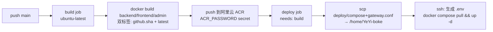

# 06 部署与运维

## 1. 环境总览

| 环境 | 编排文件 | 镜像来源 | 说明 |
|------|----------|----------|------|
| 本地/开发 | 根目录 `docker-compose.yml` | 本地 build（`./admin`、`./backend`、`./frontend`） | 6 个服务，直接暴露本机端口 |
| 生产 | `deploy/docker-compose.prod.yml` | 阿里云 ACR（`crpi-mnquumysanjsxo76.cn-hangzhou.personal.cr.aliyuncs.com/yjkz/yeyi-boke-*`） | 由 GitHub Actions 自动部署到腾讯云服务器 |

生产编排的服务拓扑：

```
gateway (nginx:alpine, 80/443)
 ├── frontend (Nuxt SSR, 内部 3000)
 ├── admin    (nginx SPA, 内部 80；prod 另映射宿主 3001)
 ├── backend  (FastAPI, 内部 8000)
 ├── mcp      (Streamable HTTP, 内部 8100)
 ├── mysql    (8.0, healthcheck: mysqladmin ping)
 └── redis    (7-alpine, healthcheck: redis-cli ping)

volumes: mysql_data / redis_data / uploads_data（backend 挂 /backend/uploads）
backend 依赖 mysql+redis 健康后启动（condition: service_healthy）
```

本地 Compose 不启动 gateway/Nginx：admin、frontend、backend、MCP 分别通过 `localhost:3001`、`localhost:3000`、`localhost:8000`、`localhost:8100` 访问；MySQL/Redis 仍使用 `localhost:3306` 和 `localhost:6379`。

## 2. 关键环境变量

| 变量 | 用于 | 示例 |
|------|------|------|
| `DATABASE_URL` | backend | `mysql+asyncmy://root:<pwd>@mysql:3306/yeyi_blog` |
| `REDIS_URL` | backend | `redis://redis:6379/0` |
| `JWT_SECRET_KEY` | backend | 生产密钥（必改，默认值 `change-me-in-production`） |
| `MCP_API_KEY` | backend + mcp | 生产由 GitHub Secret 注入，仅用于首次 bootstrap |
| `MCP_SETTINGS_ENCRYPTION_KEY` | backend + mcp | 生产由 GitHub Secret 注入，必须长期稳定 |
| `MCP_PUBLIC_URL` | backend + mcp | `https://blogmcp.yeyeyiyi.online/mcp` |
| `NUXT_API_BASE` | frontend | `http://backend:8000/api/v1`（SSR 内网地址） |
| `NUXT_PUBLIC_ADMIN_URL` | frontend | 前台页脚“管理入口”地址；本地 `http://localhost:3001`，生产 `https://admin.yeyeyiyi.online` |
| `MYSQL_ROOT_PASSWORD` / `MYSQL_DATABASE` | mysql | 生产从 `.env` 注入 |
| `VITE_API_BASE` | admin（可选） | 缺省为空串=同域相对路径 |
| `VITE_BLOG_URL` | admin 构建参数（可选） | Admin 顶栏“前往 Blog”地址；本地默认 `http://localhost:3000`，生产 CI 使用 `https://blog.yeyeyiyi.online` |

生产 `.env` 由 CI 在服务器上用 secrets 生成（`JWT_SECRET_KEY`、`MYSQL_ROOT_PASSWORD`、`MCP_API_KEY`、`MCP_SETTINGS_ENCRYPTION_KEY`）；部署脚本会同时写入 `blogmcp.yeyeyiyi.online` 的公开 URL、Host/Origin 限制和限流参数。生产不要依赖 Compose 内置 MCP 默认值，模板见 `deploy/.env.example`。

## 3. Nginx 网关

### `deploy/gateway.conf`（生产网关）

按域名分流，Docker 内 DNS 由 `resolver 127.0.0.11` 解析，`set $backend backend:8000` 变量形式支持容器重启后 IP 变化：

| server_name | `/` | `/api/` | `/uploads/` |
|-------------|-----|---------|-------------|
| `blog.yeyeyiyi.online` | → frontend:3000 | → backend:8000 | → backend:8000 |
| `admin.yeyeyiyi.online` | → admin:80 | → backend:8000 | → backend:8000 |
| `api.yeyeyiyi.online` | → backend:8000（全量） | — | — |
| `blogmcp.yeyeyiyi.online` | `/mcp`、`/health` → mcp:8100；`/uploads/` → backend:8000（MCP 上传图片的 URL 回源） | — | — |

- blog/admin 两个 server 块均附加安全头：`X-Frame-Options: SAMEORIGIN`、`X-Content-Type-Options: nosniff`、`Referrer-Policy`
- `client_max_body_size`：blog/admin/api 三个 server 块为 `10m`（大于后端 5MB 上传限制，富余）；blogmcp 块为 `12m`（MCP 上传的 5MB 图片经 base64 膨胀约 6.7MB 加 JSON 开销，且应用层 FastMCP 上限约 7.05MB 会先行拒绝，网关兜底）
- 两个 server 块另配 `location /fonts/`：分片字体文件名是内容哈希，隐藏上游 Cache-Control 后统一返回 `public, max-age=31536000, immutable` 一年长缓存
- 生产 443 另挂载两个证书目录服务同机其他项目（`tavily`、`obsidian` 反代），与博客业务无关但共用 gateway 容器

### admin 容器内 `admin/nginx.conf`

SPA 自托管 Nginx：`try_files $uri $uri/ /index.html`（history 路由回退）；`/api/`、`/uploads/` 反代 backend；`/assets/` 缓存 7 天。

## 4. 各镜像构建

| 镜像 | Dockerfile | 构建阶段 | 运行方式 |
|------|-----------|----------|----------|
| backend | `backend/Dockerfile` | python:3.11-slim，阿里云 pip 源装依赖 | `entrypoint.sh`：`alembic upgrade head` → `python seed.py` → `uvicorn app.main:app --host 0.0.0.0 --port 8000` |
| frontend | `frontend/Dockerfile` | builder `node:24-slim`（cn-font-split 原生内核不兼容 musl）：`npm ci` → 显式下载内核 7.6.8（sha256 校验）→ `npm run font:build` → `npm run build` | `node .output/server/index.mjs`（Node SSR，runner 仍为 node:24-alpine） |
| admin | `admin/Dockerfile` | builder `node:24-slim`：同上内核下载与 `font:build` → `npm run build`（vue-tsc 类型检查） | nginx:alpine 托管 dist + 反代配置 |

## 5. CI/CD（`.github/workflows/deploy.yml`）

触发：push 到 `main`；并发组 `yeyi-blog-production`（不取消进行中的部署）。



- 两个 job 均绑定 GitHub Environment `腾讯云4h4g`（可加审批保护）
- 所需 secrets：`ACR_PASSWORD`、`SERVER_IP`、`SSH_KEY`、`JWT_SECRET_KEY`、`MYSQL_ROOT_PASSWORD`、`MCP_API_KEY`、`MCP_SETTINGS_ENCRYPTION_KEY`（后两者由部署脚本强制校验，缺失即部署失败）
- 首次部署时容器启动链自动完成：Alembic 迁移 → 种子数据（admin/admin123）→ uvicorn

## 6. 常用运维命令

```bash
# 本地全套启动
docker compose up -d --build

# 查看日志 / 重启单个服务（生产 gateway）
docker compose logs -f backend
docker compose -f deploy/docker-compose.prod.yml restart gateway

# 生产（服务器 /home/YeYi-boke）
docker compose -f docker-compose.prod.yml pull
docker compose -f docker-compose.prod.yml up -d

# 进入数据库
docker exec -it mysql mysql -uroot -p yeyi_blog

# 手动执行迁移 / 种子（backend 容器内）
docker exec -it yeyi_blog_backend alembic upgrade head
docker exec -it yeyi_blog_backend python seed.py
```

## 7. 备份要点

- `mysql_data` 卷：全部业务数据（文章/评论/配置/统计）
- `uploads_data` 卷：上传图片（文章封面与插图，丢失不可再生）
- Redis 数据可丢弃（仅 token/计数缓存），重启即重建

### MCP 服务

MCP 服务复用 backend 镜像，使用独立进程监听 `8100`，并挂载同一个 `uploads_data` 卷。生产 CI 必须注入 API Key 和 Fernet 密钥；前者只在首次创建设置记录时作为 bootstrap Key，后者必须保持稳定。生产 Compose 对这两个变量使用必填校验，缺失时会在解析阶段失败；本地开发请使用根目录 Compose 的默认值或显式 `.env`。

可选设置 `MCP_ALLOWED_HOSTS` 与 `MCP_ALLOWED_ORIGINS`（JSON 数组）限制传输层 Host/Origin；Redis 使用原子 Lua 计数实现固定窗口限流，避免并发绕过。

首次部署后访问 admin 的 `/mcp` 页面，在“密钥管理”创建多个独立 Key。保存、启停或删除会使 backend 删除 Redis 运行时缓存，因此独立 mcp 进程会立即读取最新 Key 集合；被停用或删除的 Key 返回 `401`，无需重建容器。不要为常规 Key 管理变更 `MCP_SETTINGS_ENCRYPTION_KEY`，否则保存的 Key 无法解密。请求日志保留期默认 90 天，可在后台调整或手动清理。

公网入口为 `https://blogmcp.yeyeyiyi.online/mcp`；生产网关同时配置 80/443（证书目录 `/etc/liteSSL/YeYi-blog` 中必须存在 `blogmcp` 与 `blogmcp-key`，且证书 SAN 必须包含该域名），对该路径使用 HTTP/1.1、关闭缓冲并设置长连接超时。部署后用 `openssl s_client -connect blogmcp.yeyeyiyi.online:443 -servername blogmcp.yeyeyiyi.online` 核验 SAN；客户端可使用 `?tavilyApiKey=<key>` 或 `?api_key=<key>`，也兼容 `X-MCP-API-Key` 请求头认证。
